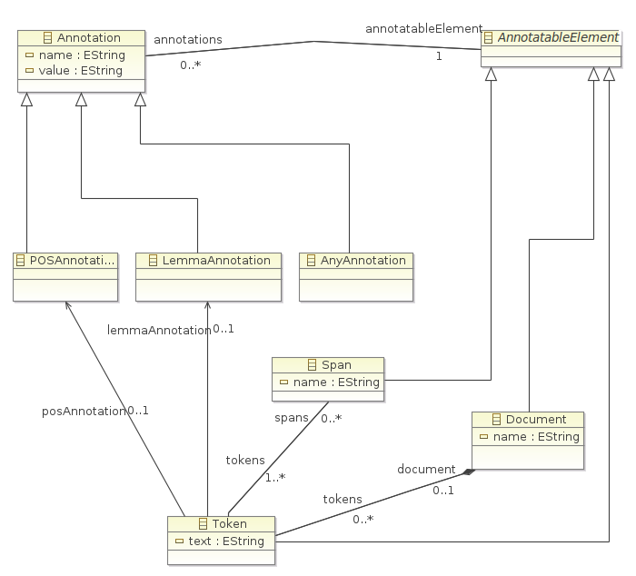

treetagger-emf-api
==================

Searching for an easy way to make data coming from the TreeTagger accessible in Java?

This project may help you. We here provide an api written in Java, to read and write data in the format produced by the tool TreeTagger by Helmut Schmid (see: http://www.cis.uni-muenchen.de/~schmid/tools/TreeTagger/).

"The TreeTagger is a tool for annotating text with part-of-speech and lemma information. It was developed by Helmut Schmid in the TC project at the Institute for Computational Linguistics of the University of Stuttgart. The TreeTagger has been successfully used to tag German, English, French, Italian, Dutch, Spanish, Bulgarian, Russian, Portuguese, Galician, Chinese, Swahili, Slovak, Latin, Estonian and old French texts and is adaptable to other languages if a lexicon and a manually tagged training corpus are available." [see: http://www.cis.uni-muenchen.de/~schmid/tools/TreeTagger/ last visited: 2013-11-18]


model
===
The here provided api bases on a EMF model (see: http://www.eclipse.org/modeling/emf/) we created for the TreeTagger data. The model is rather simple and consists of only 6 base elements. All elements and their relations between each other are shown in the following figure.



The base elements of the model are: Document, Span, Token and Annotation. Annotation is an abstract element, which is specified by the sub elements: 
* POSAnnotation (to be used as a part-of-speech annotation), 
* LemmaAnnotation (to be used as a lemma annotation) and 
* AnyAnnotation (to be used as any kind of an annotation, which is representable as a name-value pair). 

An object of type Document represents a container element, it can be seen similar to a TreeTagger file. A Token represents a piece of a text, which is in general a word or a punctuation mark. The text is given by the field Token.text. Each Token object can be annotated by one of the listed types of annotations. A number of token objects can be bundled by a Span object, which can also be annotated. Bundling Token objects to such a Span object allows a grouping, for instance grouping words to a sentence etc. .

maven
===
You can also plug-in this api into your code via maven. 

```xml
<groupId>de.hu_berlin.german.korpling</groupId>
<artifactId>treetagger-emf-api</artifactId>
<version>VERSION</version>
```

To access the maven coordinates, you need to include our maven repoitory:

```xml
<repositories>
  <repository>
    <id>korpling</id>
    <name>korpling maven repo</name>
    <url>http://korpling.german.hu-berlin.de/maven2</url>
  </repository>
</repositories>
```

contribute
===
Please help us, to make the api better and give us feedback and send a bug report or a feature request.

license
===
  Copyright 2009 Humboldt University of Berlin, INRIA.

  Licensed under the Apache License, Version 2.0 (the "License");
  you may not use this file except in compliance with the License.
  You may obtain a copy of the License at
 
  http://www.apache.org/licenses/LICENSE-2.0

  Unless required by applicable law or agreed to in writing, software
  distributed under the License is distributed on an "AS IS" BASIS,
  WITHOUT WARRANTIES OR CONDITIONS OF ANY KIND, either express or implied.
  See the License for the specific language governing permissions and
  limitations under the License.
